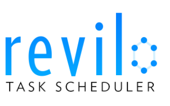

<div align="center">
<a href="https://github.com/mohan-cao/revilo"></a>
<br>
<sup>Master branch is currently </sup><a href="https://travis-ci.com/mohan-cao/revilo"></a>
</div>

# Revilo Task Scheduler
The official page for the Revilo (**ruh-*VEE*-low**) Task Scheduler Project!

## Introduction and Usage
Revilo Task Scheduler takes in a graph file (.dot or .gxl) and outputs a DOT file with an optimal schedule.

``java -jar revilo.jar [INPUT.DOT] [NUM-OF-PROCESSORS] [OPTIONAL ARGS]``

The output file will be created in the same directory. Optional arguments are as followed:

* ``-v`` Enables GUI visualization with live statistics and schedule updating.
* ``-o [FILENAME]`` Specifies the output file's name.
* ``-p [THREADS]`` Specifies the number of threads Revilo should be run on.

By default, Revilo will be run sequentially with no visualization.

## Quick References
Meeting minutes, plans, research, and other administrivia can be found in the [Revilo Wiki](https://github.com/mohan-cao/revilo/wiki).

Issue tracking is mainly done through the Issues tab.

Shared Google Drive folder for resources: [Revilo Project Folder](https://drive.google.com/open?id=0B6EjuC_mOLoyZ2NCa0RuOEp4Y3c)

For developers, please only merge branches if they pass the unit tests on the build server!

## The Team
| Name         | UPI     | Uni ID | GitHub    |
| ------------ | ------- | ------ | --------- |
| Abby Shen    | [ashe848](mailto:ashe848@aucklanduni.ac.nz) | 269481021 | [ashe848](http://www.github.com/ashe848)   |
| Aimee Tagle  | [atag549](mailto:atag549@aucklanduni.ac.nz) | 8194348 | [abtagle](http://www.github.com/abtagle)   |
| Mohan Cao    | [mcao024](mailto:mcao024@aucklanduni.ac.nz) | 820512142 | [mohan-cao](http://www.github.com/mohan-cao) |
| Michael Kemp | [mkem114](mailto:mkem114@aucklanduni.ac.nz) | 6273632 | [mkem114](http://www.github.com/mkem114)   |
| Terran Kroft | [tkro003](mailto:tkro003@aucklanduni.ac.nz) | 6869815 | [itemic](http://www.github.com/itemic)    |

## Quick Startup Guide

Clone the project anywhere

`git clone git@github.com:mohan-cao/revilo.git`

Using IntelliJ IDEA:

1. Import project as Maven project
2. Wait for IntelliJ to fetch the required resources
3. Yay!

Using Eclipse (Start from Eclipse instead of importing clone!):

1. Right click the left-hand side package explorer (where you have projects and stuff)
2. Go to Import... > Git > Clone from repository
3. If ssh not set up: clone with HTTPS `https://github.com/mohan-cao/revilo.git` 
4. Set up as new project using Project Wizard
5. Name it "revilo"
6. Right click project > Configure > Convert into Maven project
7. Done! 

## Installation and Running Unit Tests

`mvn clean` - Cleans project (start from scratch)

`mvn clean test` - Run unit test (from scratch)

`mvn test` - Run unit tests

`mvn build` - Builds your project. Good enough for most cases

`mvn package` - Package classes into a jar. JAR is executable.

`mvn install` - Do all the above and install the package

# Parallel Task for Java Usage

1. IntelliJ Preferences/Editor/File and Code Templates -> Add a new template named PTJava Class with extension ptjava. Paste in
```
#if (${PACKAGE_NAME} && ${PACKAGE_NAME} != "")package ${PACKAGE_NAME};#end
#parse("File Header.java")
public class ${NAME} {
}
```
2. IntelliJ Preferences/Editor/File Types -> Select "Java Source"
   - Add an association to *.ptjava (so that code autocompletion still works)
3. When you run `mvn build`, `mvn process-sources` or any compile lifecycle, then .ptjava files are automatically preprocessed into equivalent .java files

# Advanced - Here Be Dragons!

```
mvn install:install-file -Dfile=<path-to-file> -DgroupId=<group-id> \
    -DartifactId=<artifact-id> -Dversion=<version> -Dpackaging=<packaging>
```
Self explanatory installation of local jar to local Maven repo. Hard to remember so I put it here.
